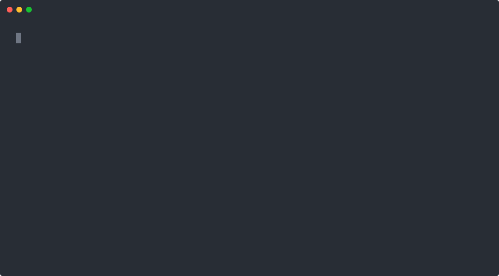

# Frontend Promotion Guard

[](https://github.com/Reality-JH/frontend-promotion-guard/actions/workflows/matrix.yml) [](https://github.com/Reality-JH/frontend-promotion-guard/tags) [](./LICENSE)

English is the default project language. [简体中文](./README.zh-CN.md) · [v0.3.0 notes](./docs/v0.3.0-release.md) · [Launch article](./docs/launch-post.md)

Frontend Promotion Guard (FPG) is a reusable release gate for failures that ordinary health checks miss: the build succeeds, HTTP returns 200, and the container is healthy, while production CSS or layout is broken.

FPG audits emitted CSS, evaluates real browser-computed styles, compares screenshots across routes and viewports, accepts an isolated candidate container, promotes only after acceptance, and restores the previous image when production re-verification fails. Every run produces a static HTML evidence report.

FPG does not replace functional testing, security testing, or human acceptance. A human must confirm a correct page before explicitly updating visual baselines.



## Use the smallest gate that matches the work

FPG is not a mandatory deployment step after every frontend edit. Choose the level by the current objective:

| Level | When to run | Command and boundary |
| --- | --- | --- |
| Targeted check | One feature or defect is still being implemented | Use the project's focused test first. Run `fpg audit` only when emitted CSS is the risk. It does not start browsers, build images, restart services, or inspect unrelated routes. |
| Module gate | A related batch is ready on an already running target | Run `fpg verify` for the configured routes and viewports. It observes the target but does not build images, restart services, or promote a release. |
| Release gate | A deployment or release was explicitly requested, the deployed environment is required for acceptance, or an agreed release checkpoint was reached | Run `fpg promote`. This command builds or starts the candidate, mutates container state after acceptance, re-verifies production, and may roll back. |

A passing FPG report proves only the configured release checks. It does not prove that the feature's business behavior is complete. Finish the targeted business flow before escalating to a broader gate, and run a shared gate once per agreed batch rather than once per checklist item.

## The failure this is meant to catch

These two screenshots show the kind of release that can pass a build, return HTTP 200, and still be visibly wrong. The first page has lost its intended layout and controls; the second is the same area after the frontend assets are served correctly.

| Broken after release | Correct rendering |
| --- | --- |
|  |  |

The images are illustrative incident evidence, not visual baselines for this repository. FPG catches the underlying class of failure with CSS checks, computed-style assertions, and screenshot comparison before promotion.

## Quick start

Node.js 20+ and a system Chrome or Edge are required. Docker is optional unless `promote` or `rollback` is used.

```bash
npm install
npm run build
cp fpg.example.yml fpg.yml
node dist/cli.js audit --config fpg.yml
node dist/cli.js baseline update --config fpg.yml
node dist/cli.js verify --config fpg.yml
```

PowerShell:

```powershell
.\scripts\fpg.ps1 verify --config .\fpg.yml
```

Set `browserPath` or `FPG_BROWSER_PATH` to override system browser discovery. FPG uses `playwright-core` and never downloads a browser.

## Configuration

The complete minimal example is [`fpg.example.yml`](./fpg.example.yml). All fields are configurable:

- `routes`: route name, path, and the ready selector that marks the page usable.
- `viewports`: screenshot width and height pairs.
- `cssAudit`: CSS file globs, forbidden source directives, and required selectors.
- `computedStyles`: selector, CSS property, and exactly one of `equals` or `notEquals`.
- `visual`: pixel thresholds, baseline directory, evidence directory, and run retention.
- `docker`: candidate and production images, containers, ports, build context, Dockerfile, extra arguments, health path, and the rollback switch.

Relative paths resolve from the YAML file location. Both Windows `\` and Linux `/` CSS glob separators are accepted. Point evidence and baseline directories at a disk with room for PNG output.

## Commands

```text
fpg audit
fpg capture
fpg compare
fpg verify
fpg baseline update
fpg promote
fpg rollback IMAGE
fpg report
```

- `audit`: emitted-CSS checks only.
- `capture`: collects current screenshots and computed styles without touching baselines.
- `compare`: computed-style and screenshot regression; a missing baseline fails.
- `verify`: `audit + compare`.
- `baseline update`: the only command allowed to write baselines; must run explicitly.
- `promote`: starts the candidate on an isolated port, accepts it, then promotes; failed production re-verification rolls back automatically.
- `rollback IMAGE`: restores an explicit immutable image.
- `report`: regenerates the HTML report for the most recent run.

Only `baseline update` writes baselines. A failed test never replaces them.

The HTML report includes baseline, current, and diff images, immutable image IDs, Git commit, runtime and browser versions, stage timings, test results, final production state, and rollback state. External commands are spawned with argument arrays rather than shell strings. Common Cookie, Authorization, token, API key, password, and secret patterns are redacted from command output; configuration files must still contain no secrets.

Configuration is validated before a browser or Docker operation starts. Set `docker.requireImmutableImage: true` to require a digest or image ID for an existing candidate and explicit rollback. FPG records the resolved candidate, previous production, and final production image IDs even when ordinary tags are used.

`promote` and `rollback` share a repository-local release lock. Concurrent release operations fail with the lock owner's PID, start time, and commit. CI workflows should also use native workflow concurrency because a local lock cannot coordinate separate runners.

## GitHub Actions

```yaml
- uses: Reality-JH/frontend-promotion-guard@v0.3.0
  with:
    config: fpg.yml
    command: verify
- if: always()
  uses: actions/upload-artifact@v4
  with:
    name: frontend-promotion-evidence
    path: release-evidence
```

Build and start the target before this step. See [`.github/workflows/example.yml`](./.github/workflows/example.yml) for a runnable Vite/React example and [`.github/workflows/matrix.yml`](./.github/workflows/matrix.yml) for the cross-platform matrix.

The Action defaults to the non-mutating `verify` command. A release workflow that intentionally uses `command: promote` must also set `confirm-promotion: true`; ordinary pull-request and feature workflows should not set it.

## Frequently asked questions

**The build passed and the health check is green, but the deployed page is unstyled. What catches that?**
This is the exact failure FPG exists for. `verify` opens the served page in real Chrome or Edge and asserts computed styles: in the repository's broken-CSS demo the page returns HTTP 200 with an empty stylesheet, the pixel diff stays under the configured 12 percent ceiling at 5.537 percent, and the computed-style assertion still fails the run because `.status-grid` computes `block` instead of `grid`. `audit` catches the sibling failure where the emitted CSS itself never compiled.

**How is this different from Percy, Chromatic, BackstopJS, or Playwright screenshot tests?**
Those tools cover visual review or give you a framework to build gates on. FPG is a self-contained release gate: it adds emitted-CSS audits, computed-style assertions, overflow and console checks, Docker candidate promotion with a verified rollback path, and a static HTML evidence report. It runs on your own runner with a system browser and keeps evidence as local files. No SaaS dashboard is required.

**Does it replace functional or end-to-end tests?**
No. FPG verifies that the delivered page still renders like the approved baseline. It does not click through business flows, and it is not a substitute for feature tests, security tests, accessibility review, or human acceptance of new pages.

## Maintainer and contact

Maintainer: `Reality-JH`. Use repository Issues for ordinary questions. Report security issues to `849034843@qq.com`; do not include credentials, cookies, tokens, or business data in public issues.

## Continuous license scanning

```bash
npm run license:check
```

Every push and pull request scans production dependency licenses and runs the npm production vulnerability audit at high severity. The allowlist and license record are documented in [`THIRD_PARTY_LICENSES.md`](./THIRD_PARTY_LICENSES.md).

## Docker platform matrix

`.github/workflows/matrix.yml` runs Node 20 and 22 browser, test, and license checks on Ubuntu, Windows, and macOS. Its Ubuntu Docker job executes four end-to-end scenarios: successful promotion, candidate rejection without production mutation, production failure with verified restoration, and rollback verification failure. Every scenario asserts the final production container image ID.

## Baseline review

`baseline update` writes `visual-baselines/manifest.json` with a SHA-256 digest for every approved image. The GitHub Action intentionally does not allow baseline updates. Update baselines locally, review the old image, current image, and diff, then commit image and manifest changes through a pull request. Pin the runner OS, browser major version, and fonts when pixel stability matters.

## Docker promotion model

`promote` records the running production container's image ID and tags it as a timestamped rollback image. It optionally builds the candidate image, runs the full acceptance checks against the candidate on an isolated port, then tags the candidate as production, rebuilds the production container, and runs the same checks again. When production re-verification fails, FPG rebuilds production from the retained image and verifies the restore before reporting `restored`.

## Development

```bash
npm run typecheck
npm run build
npm test
npm run example:build
```

The locked dependency license audit is in [`THIRD_PARTY_LICENSES.md`](./THIRD_PARTY_LICENSES.md). This project is MIT licensed.
