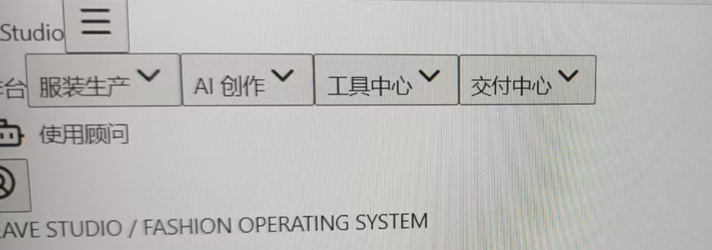

# Frontend Promotion Guard

English is the default project language. [简体中文](./README.zh-CN.md) · [v0.3.0 notes](./docs/v0.3.0-release.md) · [Launch article](./docs/launch-post.md)

Frontend Promotion Guard (FPG) is a reusable release gate for failures that ordinary health checks miss: the build succeeds, HTTP returns 200, and the container is healthy, while production CSS or layout is broken.

FPG audits emitted CSS, evaluates real browser-computed styles, compares screenshots across routes and viewports, accepts an isolated candidate container, promotes only after acceptance, and restores the previous image when production re-verification fails. Every run produces a static HTML evidence report.

FPG does not replace functional testing, security testing, or human acceptance. A human must confirm a correct page before explicitly updating visual baselines.

## Use the smallest gate that matches the work

FPG is not a mandatory deployment step after every frontend edit. Choose the level by the current objective:

| Level | When to run | Command and boundary |
| --- | --- | --- |
| Targeted check | One feature or defect is still being implemented | Use the project's focused test first. Run `fpg audit` only when emitted CSS is the risk. It does not start browsers, build images, restart services, or inspect unrelated routes. |
| Module gate | A related batch is ready on an already running target | Run `fpg verify` for the configured routes and viewports. It observes the target but does not build images, restart services, or promote a release. |
| Release gate | A deployment or release was explicitly requested, the deployed environment is required for acceptance, or an agreed release checkpoint was reached | Run `fpg promote`. This command builds or starts the candidate, mutates container state after acceptance, re-verifies production, and may roll back. |

A passing FPG report proves only the configured release checks. It does not prove that the feature's business behavior is complete. Finish the targeted business flow before escalating to a broader gate, and run a shared gate once per agreed batch rather than once per checklist item.

## The failure this is meant to catch

These two screenshots show the kind of release that can pass a build, return HTTP 200, and still be visibly wrong. The first page has lost its intended layout and controls; the second is the same area after the frontend assets are served correctly.

| Broken after release | Correct rendering |
| --- | --- |
|  |  |

The images are illustrative incident evidence, not visual baselines for this repository. FPG catches the underlying class of failure with CSS checks, computed-style assertions, and screenshot comparison before promotion.

## Quick start

Node.js 20+ and a system Chrome or Edge are required. Docker is optional unless `promote` or `rollback` is used.

```bash
npm install
npm run build
cp fpg.example.yml fpg.yml
node dist/cli.js audit --config fpg.yml
node dist/cli.js baseline update --config fpg.yml
node dist/cli.js verify --config fpg.yml
```

PowerShell:

```powershell
.\scripts\fpg.ps1 verify --config .\fpg.yml
```

Set `browserPath` or `FPG_BROWSER_PATH` to override system browser discovery. Relative paths resolve from the YAML file. Routes, selectors, viewports, thresholds, evidence and baseline directories, retention, image names, ports, container names, and Docker arguments are configurable; see [`fpg.example.yml`](./fpg.example.yml).

## Commands

`audit`, `capture`, `compare`, `verify`, `baseline update`, `promote`, `rollback IMAGE`, and `report` are available. Only `baseline update` writes baselines. A failed test never replaces them.

The HTML report includes baseline, current, and diff images, immutable image IDs, Git commit, runtime and browser versions, stage timings, test results, final production state, and rollback state. External commands are spawned with argument arrays rather than shell strings. Common Cookie, Authorization, token, API key, password, and secret patterns are redacted from command output; configuration files must still contain no secrets.

Configuration is validated before a browser or Docker operation starts. Set `docker.requireImmutableImage: true` to require a digest or image ID for an existing candidate and explicit rollback. FPG records the resolved candidate, previous production, and final production image IDs even when ordinary tags are used.

`promote` and `rollback` share a repository-local release lock. Concurrent release operations fail with the lock owner's PID, start time, and commit. CI workflows should also use native workflow concurrency because a local lock cannot coordinate separate runners.

## GitHub Actions

```yaml
- uses: Reality_JH/frontend-promotion-guard@v0.3.0
  with:
    config: fpg.yml
    command: verify
- if: always()
  uses: actions/upload-artifact@v4
  with:
    name: frontend-promotion-evidence
    path: release-evidence
```

Build and start the target before this step. See [`.github/workflows/example.yml`](./.github/workflows/example.yml) for a runnable Vite/React example and [`.github/workflows/matrix.yml`](./.github/workflows/matrix.yml) for the cross-platform matrix.

The Action defaults to the non-mutating `verify` command. A release workflow that intentionally uses `command: promote` must also set `confirm-promotion: true`; ordinary pull-request and feature workflows should not set it.

## Maintainer and contact

Maintainer: `Reality_JH`. Use repository Issues for ordinary questions. Report security issues to `849034843@qq.com`; do not include credentials, cookies, tokens, or business data in public issues.

## Continuous license scanning

```bash
npm run license:check
```

Every push and pull request scans production dependency licenses and runs the npm production vulnerability audit at high severity. The allowlist and license record are documented in [`THIRD_PARTY_LICENSES.md`](./THIRD_PARTY_LICENSES.md).

## Docker platform matrix

`.github/workflows/matrix.yml` runs Node 20 and 22 browser, test, and license checks on Ubuntu, Windows, and macOS. Its Ubuntu Docker job executes four end-to-end scenarios: successful promotion, candidate rejection without production mutation, production failure with verified restoration, and rollback verification failure. Every scenario asserts the final production container image ID.

## Baseline review

`baseline update` writes `visual-baselines/manifest.json` with a SHA-256 digest for every approved image. The GitHub Action intentionally does not allow baseline updates. Update baselines locally, review the old image, current image, and diff, then commit image and manifest changes through a pull request. Pin the runner OS, browser major version, and fonts when pixel stability matters.

## Development

```bash
npm run typecheck
npm run build
npm test
npm run example:build
```

The locked dependency license audit is in [`THIRD_PARTY_LICENSES.md`](./THIRD_PARTY_LICENSES.md). This project is MIT licensed.
