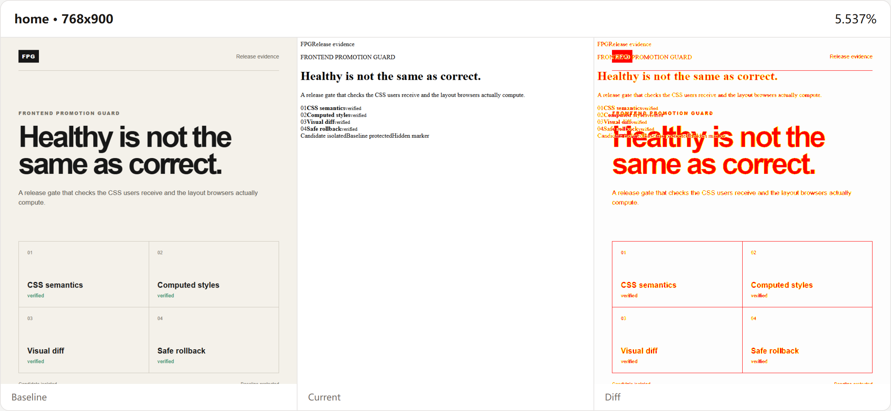
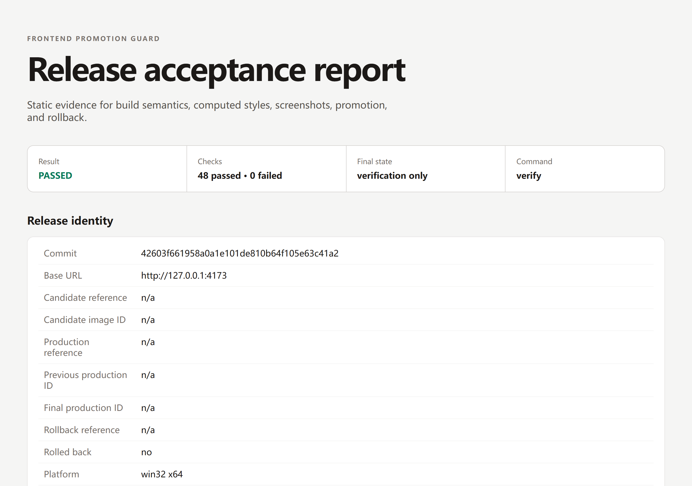
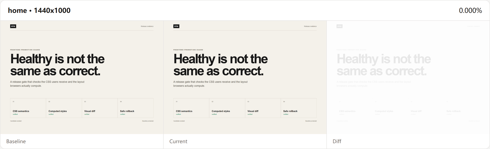
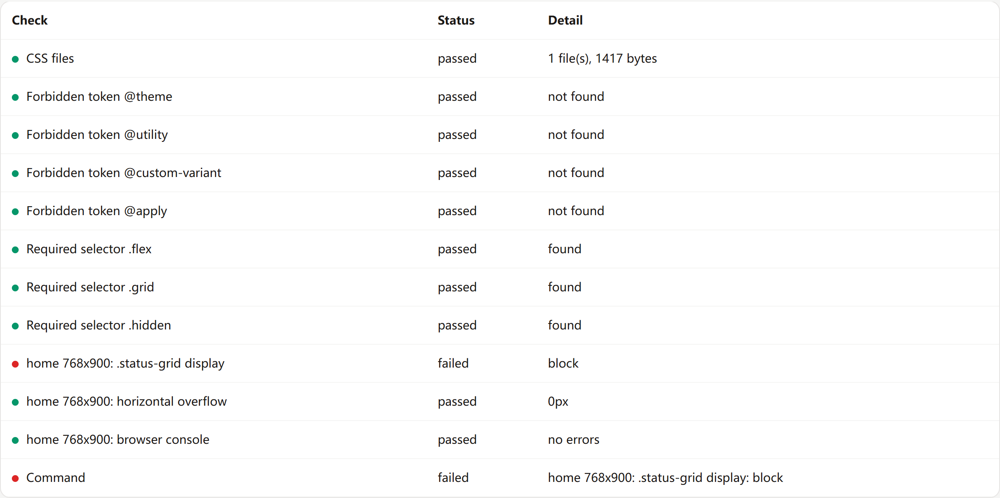
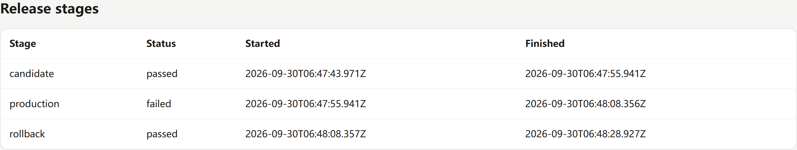
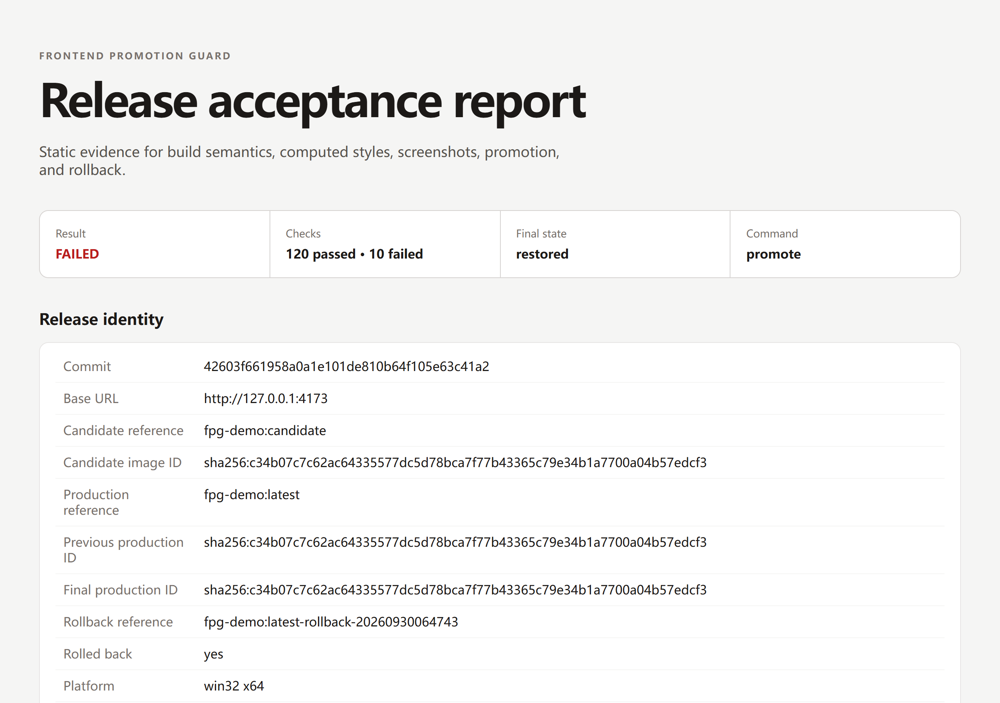

# 构建通过、容器健康，但页面坏了


发布流水线兑现了它承诺的每一件事：镜像构建成功，容器启动，健康检查接口在一秒内返回 200，负载均衡开始导入流量。

页面仍然是坏的。在构建产物和浏览器之间的某一环，样式表变成了一个空壳：HTTP 200，但响应里没有任何规则。用户看到的是没有样式的 HTML，原本界面所在的位置只剩默认渲染的文字。

流水线里没有谁撒谎。每一项检查都如实回答了它被问到的问题。问题在于没有任何一项检查被问到正确的问题：用户实际收到的页面，和团队验收时看到的页面，渲染出来还是同一个样子吗？

| 发布后已损坏 | 正常渲染 |
| --- | --- |
|  |  |

[Frontend Promotion Guard](https://github.com/Reality-JH/frontend-promotion-guard)（FPG）就是针对这种事故形态做的：技术上健康，视觉上损坏。

## 两个盲区

**健康检查度量的是存活，不是正确。** `/` 返回 200 只说明服务器能应答。它不说明浏览器为样式表收到了哪些字节，不说明 CDN 或反代改动之后资源路径是否还能解析，也不说明送达的 CSS 是不是构建产出的那份。上面这个场景里，页面一行样式都没有，所有探针却全是绿的。

**只靠截图对比存在阈值问题。** 像素对比是好的绊线，却是弱的裁判。下面是一次真实运行：故意起了一个故障示例服务，样式表接口返回 `/* intentionally broken */`，状态码 200，页面完全失去样式。实测像素差异是 5.537%，而示例配置的上限是 12%。一个只做像素对比的门禁会放过这次发布。



像素对比作为绊线的价值保留，但判定需要第二个理解页面本应是什么的信号。

## 三级门禁

FPG 是一个 TypeScript CLI，要求 Node.js 20+ 和系统 Chrome 或 Edge；Docker 可选，只有发布级才用。它把一次前端发布建模为三层门禁，每层的作用范围不同：

- `fpg audit` 检查产物。它按 glob 匹配构建后的 CSS 文件，发现残留的源指令（示例配置里是 `@apply`、`@theme`、`@utility`、`@custom-variant`）则失败，必需选择器缺失也失败。不启动浏览器，不碰服务，没有副作用。
- `fpg verify` 检查线上实际效果。它先跑 audit，再用真实 Chrome 或 Edge 按配置访问每条路由的每个视口：计算样式断言（`selector`、`property`，`equals` 与 `notEquals` 二选一）、横向溢出量、控制台错误收集，以及与已提交基线的 pixelmatch 对比。它只观察运行中的目标，不改变任何东西。
- `fpg promote` 检查发布。配置 Docker 后，它先把当前正式镜像 ID 快照为一个带时间戳的回退标签，再在隔离端口启动候选容器，对该端口跑完整验收，通过后才把候选标记进正式并再次复验。正式复验失败时，它恢复快照并对恢复结果再做一次验收。仓库本地发布锁会拒绝并发的 `promote` 和 `rollback`，并报告锁持有者的 PID、开始时间和 commit。

另外两个命令补全这个集合。`fpg baseline update` 是唯一能写视觉基线的命令：必须显式执行，运行失败永远不会替换基线，每次更新还会在 `visual-baselines/manifest.json` 写入每张已批准图片的 SHA-256。`fpg report` 为最近一次运行重新生成静态 HTML 报告。`capture` 和 `compare` 把 `verify` 拆成采集与回归两半，方便调试。

同样重要的是它不做什么。它不替代功能测试、安全测试、可访问性检查和人工验收。基线之所以存在，是因为有人看过页面并确认它正确。门禁的职责是保证这份认可在发布机器跑完之后依然成立。

## 一次运行产出什么

每条命令都会在 `release-evidence` 下写一个运行目录，包含 `run.json` 和自包含的 `report.html`：git commit、base URL、浏览器版本、平台、Node 版本、每条检查的状态与明细、每组截图三联图及其差异率，晋升运行还包含镜像 ID、各阶段耗时和最终生产状态。报告会遮盖 Cookie、Authorization、token 一类的凭据特征。

对内置 Vite/React 示例跑一次真实的 `verify`（2 条路由 × 4 个视口，系统 Chrome 报告 `chromium 154.0.8037.58`）：

- 48 通过、0 失败：40 条检查加 8 组视觉对比。
- 全部像素差异为 0.000%，总耗时 12.4 秒。



通过的三联图说明零差异是可以达到的：基线与当前是同一种渲染，差异图是空白。



再对故障服务跑同一个工具（`fpg.broken-test.yml`，一条路由，768x900）：

- CSS 产物检查通过。磁盘上的文件是好的，坏的是投递环节。这正是两个层级要分开的原因。
- `home 768x900: .status-grid display` 失败。期望 `grid`，实际计算值 `block`。
- 横向溢出 0px 通过，控制台没有错误，像素差异 5.537% 低于 12% 上限而通过。
- 命令 3.9 秒后以退出码 1 结束。



把这份清单再读一遍。浏览器层的五个信号里有四个都说页面没问题。拒绝签字的是计算样式断言那一行。

## 可验证回退的晋升

`promote` 面向的是容器本身就是要发布的东西的场景。用示例 Docker 配置的一次真实运行：

- 候选阶段 12.0 秒通过：候选容器在自己的端口上接受了同样的产物检查、计算样式、溢出、控制台和像素对比。
- 正式阶段 12.4 秒失败：晋升后的容器返回了坏样式表，8 组路由视口的计算样式断言全部报告 `block` 而非 `grid`。
- 回退阶段 20.6 秒通过：FPG 用晋升前快照的时间戳镜像重建了正式容器，并第三次执行验收，证明恢复确实生效。

总耗时 48.2 秒，运行记录显示 `finalState: restored`、`rolledBack: true`，报告列出了候选镜像 ID、晋升前后与最终的正式镜像 ID，以及实际使用的回退标签。





生产使用时有两个细节值得知道。`docker.requireImmutableImage: true` 会强制已有候选和显式回退使用 digest 或镜像 ID 引用；即使配置使用普通标签，记录里也会保存解析后的镜像 ID，报告因此能指出实际运行的是什么，而不是标签此刻指向什么。`fpg rollback IMAGE` 是手动逃生口，走同一套验收规则。

## 接入 CI

最小的 GitHub Actions 接入是不改变状态的 `verify`，加失败时的证据上传：

```yaml
- uses: Reality-JH/frontend-promotion-guard@v0.3.0
  with:
    config: fpg.yml
    command: verify
- if: always()
  uses: actions/upload-artifact@v4
  with:
    name: frontend-promotion-evidence
    path: release-evidence
```

Action 完全拒绝 `baseline update`；`command: promote` 也只有在设置 `confirm-promotion: true` 后才会执行，避免一次意外的输入改动改动容器状态。基线更新保留为本地人工审查的步骤：更新、比对旧图与差异图、把图片与清单通过 Pull Request 提交。对像素稳定性要求高时，固定 runner 操作系统、浏览器大版本和字体。

本地复现上面的运行：

```bash
npm ci && npm run build && npm run example:build && npm run example:serve
node dist/cli.js verify --config fpg.example.yml
FPG_BREAK_CSS=1 node examples/vite-react/server.mjs   # 第二个终端
node dist/cli.js verify --config fpg.broken-test.yml
```

## 下一步

当前探索中的方向，按我确信它该做的程度排序：面向存活目标做周期性检查的 `monitor` 命令；对比无障碍快照、屏蔽噪声区域、冻结时钟的语义化视觉对比，用来降低像素抖动；以及远程基线存储与更完整的 GitHub 报告，服务不便在仓库里提交大量 PNG 的团队。每一项都是收窄门禁的误差边界，而不是扩大它的边界。

## 要点

FPG 不承诺页面一定正确。它拒绝只凭构建产物、HTTP 状态和容器健康就宣布一次发布安全。如果你的值班故事里有一次技术上健康、视觉上损坏的发布，它要补的就是这个缺口。

维护者：Reality-JH。安全问题：`849034843@qq.com`。
